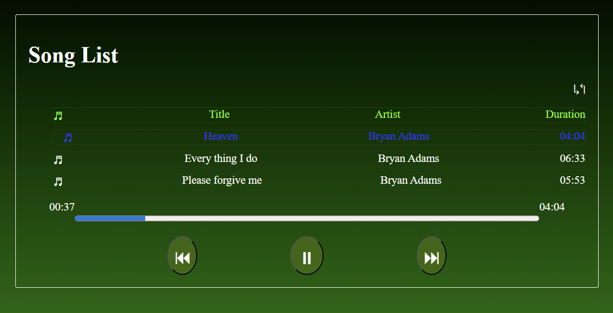

# 🎵 Simple Music Player

A simple *music player* built with *HTML, CSS, and JavaScript*.  
This app can play, pause, and navigate through a fixed playlist of *local audio files*.

## 🚀 Features
- ▶️ Play and ⏸️ Pause functionality  
- ⏮️ Previous / ⏭️ Next song navigation  
- 📂 Predefined playlist (local .mp3 files in the music folder)  
- 🎚️ Progress bar that updates with the song  
- 🎶 Song title display
-    Repeat functionality
-    Responsible design

## 🛠️ Technologies Used
- HTML5  
- CSS3  
- JavaScript  

## 📂 How to Use
1. Clone or download this repository.  
2. Open the index.html file in your browser.  
3. Enjoy the predefined playlist 🎧  

## 📸 Screenshot

---

## 📌 Notes
- This version uses a *fixed playlist* defined in the code.  
- You can add or remove songs by editing the songs array in script.js.  
- Future improvements may include:
  - Allowing users to upload their own songs  
  - Online music streaming via API  
  
